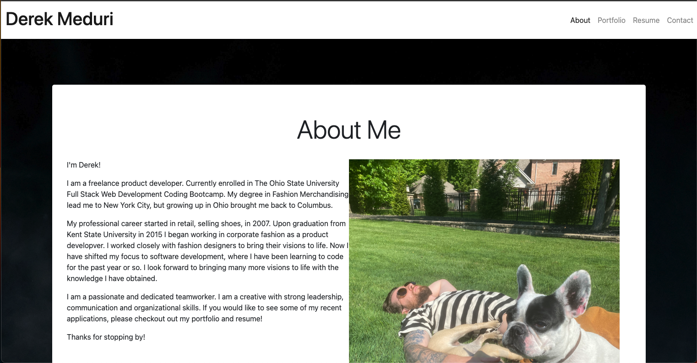
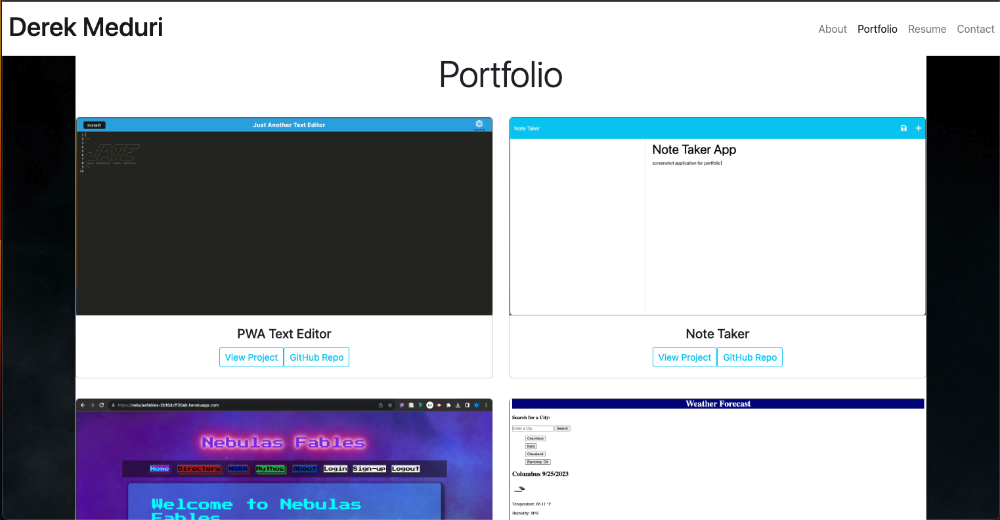
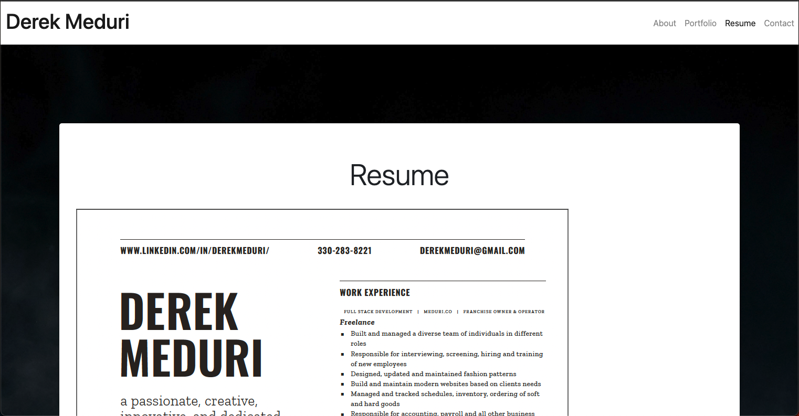
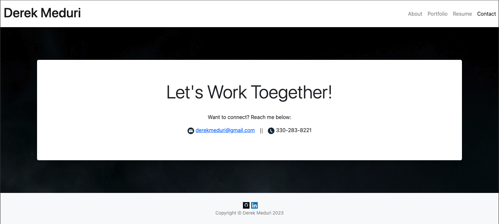

# React Portfolio

    ## Table of Contents

- - [Description](#Description)

- - [Installation](#Installation)

- - [Usage](#Usage)

- - [Deployed](#deployed)

- - [Screenshots](#screenshots)

- - [Questions](#Questions)

- - [Contributors](#Contributors)

- - [Testing](#Testing)

- - [License](#License)

    ## Description

    This portfolio was created to showcase what I have learned in The Ohio State University's Full Stack Web Development Certificate program. It includes my About Me, Portfolio, Professional Resume, and a Contact page.

    ## Installation

    npm i, npm run build, npm run dev.

    ## Usage

    personal use only

    ## Deployed

    Deployed application: [portfolio](https://derekmeduri.github.io/react-portfolio/)

    ## Screenshots

    
    
    
    

    ## Questions

    Please reach out if you have any questions regarding this application.

    - Name - Derek Meduri
    - Email - derekmeduri@gmail.com
    - GitHub - [derekmeduri](https://github.com/derekmeduri/)

    ## Contributors

    n/a

    ## Testing

    n/a

    ## License

    Licensed under MIT License.
